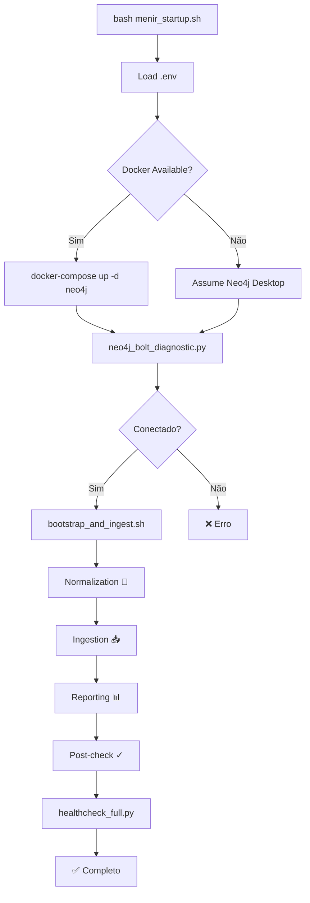

# Fallback Automático Docker ↔ Neo4j Desktop

## Visão Geral

O novo script **`scripts/menir_startup.sh`** implementa um sistema inteligente de fallback que:

1. **Detecta** se Docker está disponível no sistema
2. **Inicia** Neo4j via Docker Compose (se disponível)
3. **Fallback** para instância local Neo4j Desktop (se Docker indisponível)
4. **Testa** conectividade com Neo4j via Bolt
5. **Executa** pipeline completo de bootstrap + ingestão

---

## Arquitetura

```
┌─────────────────────────────────────────────┐
│    scripts/menir_startup.sh                  │
│    (Novo entry point)                        │
└──────────────────┬──────────────────────────┘
                   │
       ┌───────────┴───────────┐
       │                       │
       ▼                       ▼
┌─────────────────┐   ┌─────────────────┐
│ Docker Detectado│   │ Docker N/A      │
└────────┬────────┘   └────────┬────────┘
         │                    │
         ▼                    ▼
┌──────────────────┐  ┌──────────────────┐
│ docker-compose   │  │ Assume Neo4j     │
│ up -d neo4j      │  │ Desktop local    │
│ (container)      │  │ (localhost:7687) │
└────────┬─────────┘  └────────┬─────────┘
         │                    │
         └──────────┬─────────┘
                    │
                    ▼
         ┌─────────────────────────┐
         │ neo4j_bolt_diagnostic.py│
         │ (Test connectivity)     │
         └────────┬────────────────┘
                  │
       ┌──────────┴──────────┐
       │ Success             │ Failure
       ▼                     ▼
┌──────────────────┐  ┌────────────────┐
│ bootstrap_and_   │  │ Exit with erro │
│ ingest.sh        │  │ (logs avail.)  │
└──────────────────┘  └────────────────┘
```

---

## Uso Prático

### Modo 1: Docker Disponível (Codespaces, Docker Desktop, etc)

```bash
# Garanta que .env está configurado
cp .env.template .env
# Edite .env com as credenciais desejadas

# Execute o startup
bash scripts/menir_startup.sh
```

**O que acontece:**
1. ✓ Detecta Docker disponível
2. ✓ Executa `docker-compose down` (limpa container antigo, se existir)
3. ✓ Executa `docker-compose up -d neo4j`
4. ✓ Aguarda 10 segundos
5. ✓ Testa conectividade com `neo4j_bolt_diagnostic.py`
6. ✓ Executa pipeline de bootstrap e ingestão
7. ✓ Verifica saúde final

### Modo 2: Neo4j Desktop Local (sem Docker)

```bash
# Inicie Neo4j Desktop manualmente
# (ou via sytem prompt: neo4j start)

# Configure .env
cp .env.template .env
# Certifique-se de que NEO4J_URI aponta para sua instância local
# (padrão: bolt://localhost:7687)

# Execute o startup
bash scripts/menir_startup.sh
```

**O que acontece:**
1. ✓ Detecta Docker **indisponível**
2. ⏭️ Pula inicialização de container
3. ✓ Avisa: "Assumindo instância local Neo4j em bolt://localhost:7687"
4. ✓ Testa conectividade com suas credenciais de .env
5. ✓ Executa pipeline de bootstrap e ingestão (mesmo fluxo)
6. ✓ Verifica saúde final

---

## Estágios de Execução

### Stage 1: Carregamento de Ambiente
- Verifica se `.env` existe
- Carrega variáveis de ambiente
- Define padrões se não estiverem setadas

**Saída:**
```
[menir_startup] STAGE 1: Carregando variáveis de ambiente...
[menir_startup] ✓ Variáveis carregadas:
[menir_startup]   NEO4J_URI: bolt://localhost:7687
[menir_startup]   NEO4J_USER: neo4j
[menir_startup]   NEO4J_DB: neo4j
[menir_startup]   MENIR_PROJECT_ID: ITAU_15220012
```

---

### Stage 2: Detecção de Docker
- Checa se comando `docker` está disponível
- Checa se Docker daemon responde a `docker info`
- Define `DOCKER_MODE=true` ou `DOCKER_MODE=false`

**Saída (Docker Disponível):**
```
[menir_startup] STAGE 2: Detectando disponibilidade de Docker...
[menir_startup] ✓ Docker disponível — modo CONTAINER ativado
```

**Saída (Docker Indisponível):**
```
[menir_startup] STAGE 2: Detectando disponibilidade de Docker...
[menir_startup] ⚠ Docker não disponível — modo LOCAL ativado
[menir_startup] ⚠ Assumindo instância Neo4j Desktop em bolt://localhost:7687
```

---

### Stage 3: Inicialização de Neo4j
- Se Docker: executa `docker-compose down` e `docker-compose up -d neo4j`
- Se Local: apenas log informativo
- Aguarda 10 segundos para Neo4j estabilizar

**Saída (Docker Mode):**
```
[menir_startup] STAGE 3: Iniciando Neo4j...
[menir_startup] Iniciando Neo4j container via docker-compose...
[menir_startup] Verificando container existente...
[menir_startup] Aguardando Neo4j subir (10 segundos)...
[menir_startup] ✓ Neo4j container iniciado com sucesso
```

**Saída (Local Mode):**
```
[menir_startup] STAGE 3: Iniciando Neo4j...
[menir_startup] Modo LOCAL — pulando inicialização de container
[menir_startup] Verifique se Neo4j Desktop está rodando em bolt://localhost:7687
```

---

### Stage 4: Teste de Conectividade
- Executa `neo4j_bolt_diagnostic.py` com credenciais de .env
- 3 passos: driver creation → verify_connectivity → trivial query
- Aborta se falhar (com logs detalhados)

**Saída (Sucesso):**
```
[menir_startup] STAGE 4: Testando conectividade com Neo4j...
[1] ✓ Driver criado
[2] ✓ Conectividade verificada
[3] ✓ Query trivial OK
✅ Conexão Bolt + transação: OK
[menir_startup] ✓ Conectividade Neo4j OK
```

**Saída (Falha):**
```
[menir_startup] STAGE 4: Testando conectividade com Neo4j...
[ERROR] Não conseguiu conectar ao Bolt: ServiceUnavailable
[menir_startup] ✗ Falha na conexão com Neo4j
[menir_startup] ⚠ Verifique:
[menir_startup]   - Neo4j está rodando?
[menir_startup]   - Credenciais corretas em .env?
[menir_startup]   - Firewall/rede permitindo acesso a bolt://localhost:7687?
```

---

### Stage 5: Execução do Pipeline
- Invoca `scripts/menir_bootstrap_and_ingest.sh`
- Executa 5 sub-stages:
  1. **Pre-checks:** Saúde do banco
  2. **Normalization:** Raw → JSONL (emails, WhatsApp, extratos, docs)
  3. **Ingestion:** JSONL → Neo4j (Document/Event nodes)
  4. **Reporting:** Métricas e relatórios
  5. **Post-checks:** Saúde final

**Saída (Exemplo):**
```
[menir_startup] STAGE 5: Executando pipeline de bootstrap + ingestão...

========================================
Menir Itau Bootstrap & Ingest Pipeline
========================================
Project: ITAU_15220012
Neo4j: bolt://localhost:7687

[1] Pre-checks: Neo4j connectivity and health
✓ Pre-checks passed

[2] Normalization: Converting raw data to JSONL
Processing emails from ./data/itau/email/raw...
✓ Email normalization completed
...

[3] Ingestion: Loading normalized data into Neo4j
Ingesting emails from ./data/itau/email/normalized/emails.jsonl...
✓ Email ingestion completed
...

[4] Reporting: Generating audit reports and snapshots
✓ Reporting completed

[5] Post-checks: Verifying ingestion success
✓ Post-checks passed

========================================
✅ Menir Itau pipeline completed
========================================
```

---

### Stage 6: Verificação Final de Saúde
- Executa `menir_healthcheck_full.py`
- Retorna status dos nodes, relations, e dados por projeto
- Salva em `menir_health_status.json`

**Saída:**
```
[menir_startup] STAGE 6: Executando verificação final de saúde...
✓ Health Check Completed

Health Status: ok
Total Nodes: 42
Total Relations: 18
Projects: 6 (ITAU_15220012, TIVOLI, ...)
Documents: 25
Events: 8
...

[menir_startup] ✓ Health check concluído
```

---

## Modificações na Arquitetura

### 1. Novo Arquivo: `scripts/menir_startup.sh`
- Entry point único para inicialização
- 6 stages com logging detalhado
- Cores para facilitar leitura de output
- Fallback automático Docker/Local

### 2. Aprimorado: `scripts/neo4j_bolt_diagnostic.py`
- Adicionado suporte a argumentos CLI: `--uri`, `--user`, `--password`, `--db`
- Mantém compatibilidade com variáveis de ambiente
- Novo flag `--verbose` para debug
- Retorna exit codes: 0 (ok) ou 1 (erro)

### 3. Atualizado: `scripts/menir_bootstrap_and_ingest.sh`
- Substituídos TODO markers por chamadas reais
- Implementadas chamadas aos normalization tools (email, whatsapp, extratos, docs)
- Implementadas chamadas aos ingestion scripts
- Adicionado health check before/after com JSON output
- Tratamento de erros com `|| { echo "⚠ warning" }` (continua mesmo com erros)

### 4. Atualizado: `docker-compose.yml`
- Serviço `menir` agora usa `./scripts/menir_startup.sh` como command
- Permite execução automática ao rodar `docker-compose up`

---

## Configuração Recomendada (Fluxo Completo)

### Pré-requisitos
```bash
# Clone/prepare workspace
cd /workspaces/Menir

# Crie .env a partir do template
cp .env.template .env

# Edite .env com suas credenciais (se diferente dos padrões)
nano .env
```

### Execução em Docker (ex: Codespaces)
```bash
# Uma linha — tudo roda automaticamente
bash scripts/menir_startup.sh

# Ou via docker-compose (se deseja container da app também)
# docker-compose up --build menir
```

### Execução Local (ex: Neo4j Desktop)
```bash
# 1. Inicie Neo4j Desktop manualmente
#    (ou neo4j start se for versão enterprise)

# 2. Garanta credenciais em .env
nano .env
# Confirme: NEO4J_USER=neo4j, NEO4J_PWD=<sua-senha>, NEO4J_URI=bolt://localhost:7687

# 3. Execute startup
bash scripts/menir_startup.sh
```

---

## Troubleshooting

### Erro: "Arquivo .env não encontrado"
```bash
cp .env.template .env
nano .env  # Configure credenciais
bash scripts/menir_startup.sh
```

### Erro: "Neo4j container não iniciou corretamente"
```bash
# Verifique logs do container
docker-compose logs neo4j

# Limpe tudo e reinicie
docker-compose down -v
docker-compose up -d neo4j
sleep 10
bash scripts/menir_startup.sh
```

### Erro: "Falha na conexão com Neo4j" (local mode)
```bash
# Verifique se Neo4j Desktop está rodando
neo4j status

# Ou inicie manualmente
neo4j start

# Verifique credenciais em .env
cat .env | grep NEO4J

# Teste conectividade diretamente
python3 scripts/neo4j_bolt_diagnostic.py --verbose
```

### Docker detectado mas não funcionando
```bash
# Verifique Docker daemon
docker ps

# Se falhar, inicie Docker
docker version

# Se não estiver instalado, use local mode
bash scripts/menir_startup.sh  # Vai auto-fallback
```

---

## Variáveis de Ambiente

**Em `.env`:**
```bash
NEO4J_URI=bolt://localhost:7687
NEO4J_USER=neo4j
NEO4J_PWD=menir123
NEO4J_DB=neo4j
MENIR_PROJECT_ID=ITAU_15220012

# Diretórios de dados
DATA_ROOT=./data/itau
RAW_EMAILS=./data/itau/email/raw
NORM_EMAILS=./data/itau/email/normalized
RAW_EXTRATOS=./data/itau/extratos/raw
NORM_EXTRATOS=./data/itau/extratos/normalized
RAW_WHATS=./data/itau/whatsapp/raw
NORM_WHATS=./data/itau/whatsapp/normalized
DOCS=./data/itau/docs

# Logs e relatórios
LOGS=./logs/itau
REPORTS=./reports/itau
SNAPSHOT=./snapshots
```

---

## Fluxo Esperado (Sequência Completa)



---

## Próximos Passos

1. **Teste em Docker Mode:**
   ```bash
   bash scripts/menir_startup.sh
   # Ou via docker-compose:
   # docker-compose up menir
   ```

2. **Teste em Local Mode (sem Docker):**
   ```bash
   # Inicie Neo4j Desktop
   bash scripts/menir_startup.sh
   ```

3. **Verifique Health Check:**
   ```bash
   cat menir_health_status.json | jq
   ```

4. **Inspecione Dados Ingeridos:**
   ```bash
   cypher-shell -u neo4j -p menir123 "MATCH (n) RETURN labels(n), count(*) GROUP BY labels(n)"
   ```

---

## Documentação Relacionada

- `docs/TESTING.md` — Test suite execution
- `docs/IMPLEMENTATION_STATUS.md` — Full project status
- `docs/NEO4J_CONFIG.md` — Neo4j configuration reference
- `tools/README.md` — Normalization tools guide
